# Restaurant Reservation

## Live Demo

[Restaurant Reservation](https://reservation-front-end.herokuapp.com/)

This is a full stack capstone project for [Thinkful's software engineering bootcamp](https://www.thinkful.com/bootcamp/web-development/). The following scenario was given as a prompt:

> You have been hired as a full stack developer at a startup that is creating a reservation system for fine dining restaurants.
> The software is used only by restaurant personnel - at this point, the customers will not access the system online.

## User Stories

The application was developed following the user stories supplied by a figurative manager, using a test driven development process. Users (restaurant employees) of this application can currently:

- ### US-01 Create and list reservations and tables
  As a restaurant manager
  I want to create a new reservation when a customer calls
  so that I know how many customers will arrive at the restaurant on a given day.

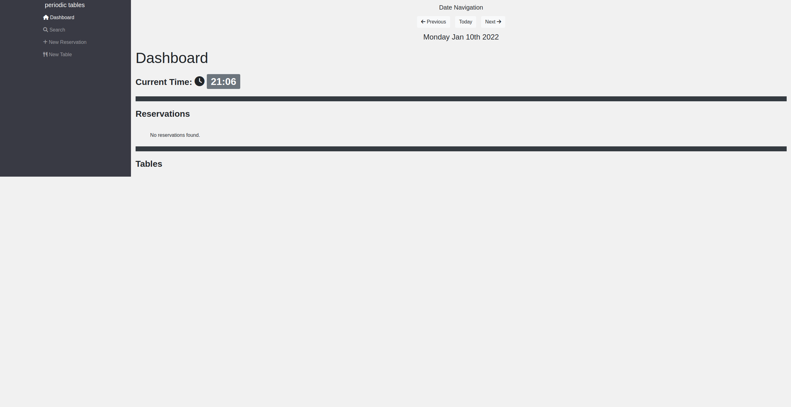
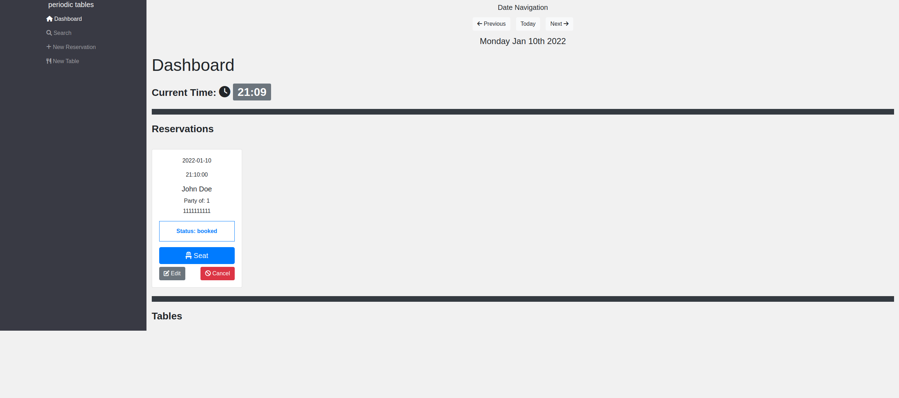
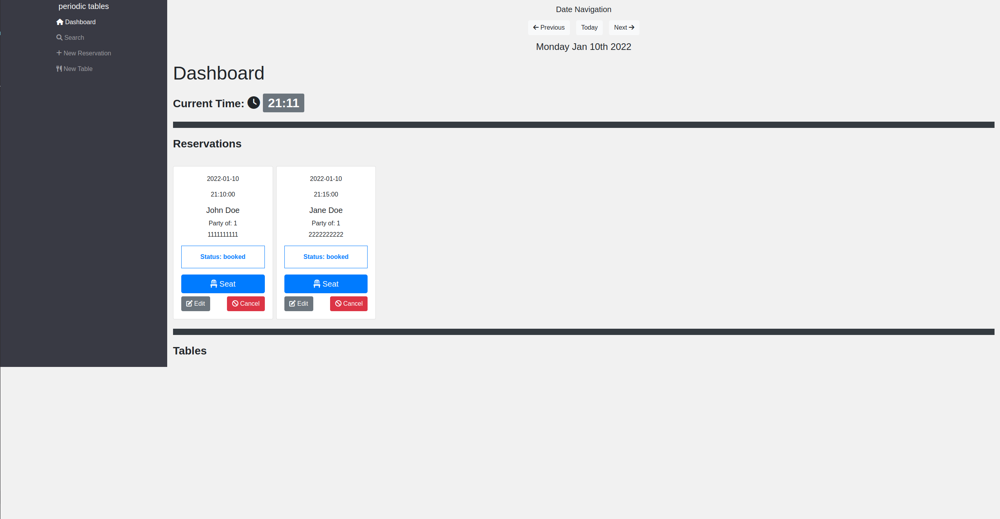

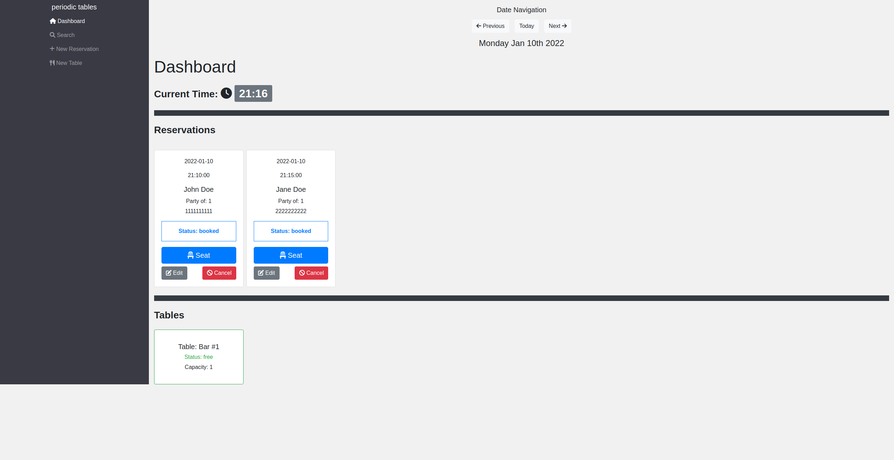
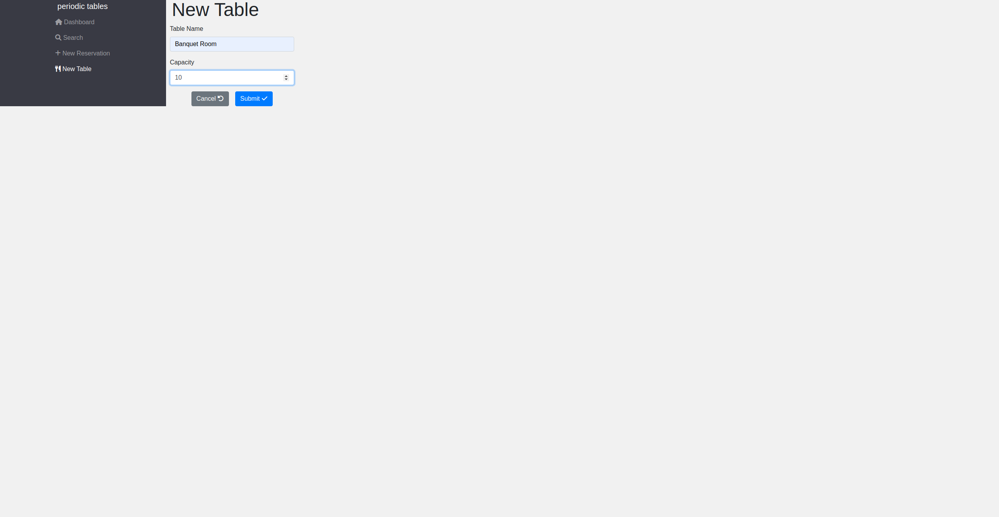
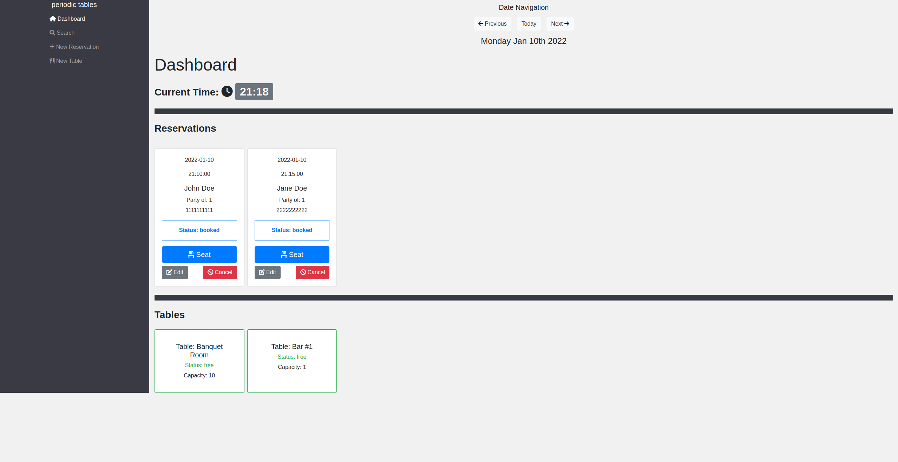

- ### US-02 Create reservation on a future, working date

  As a restaurant manager
  I only want to allow reservations to be created on a day when we are open
  so that users do not accidentally create a reservation for days when we are closed.

  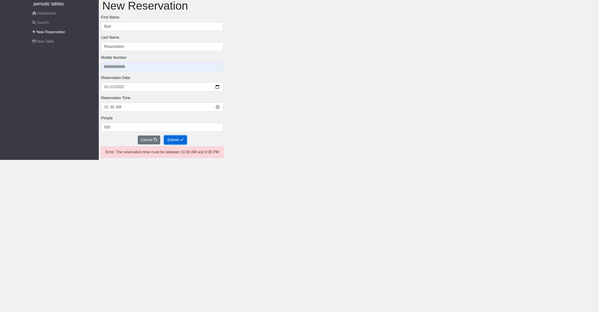
  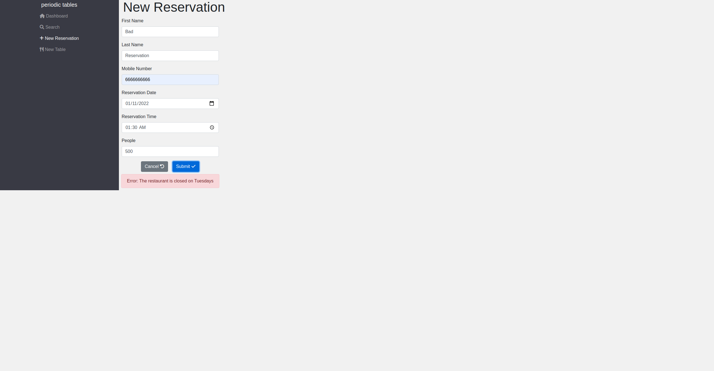
  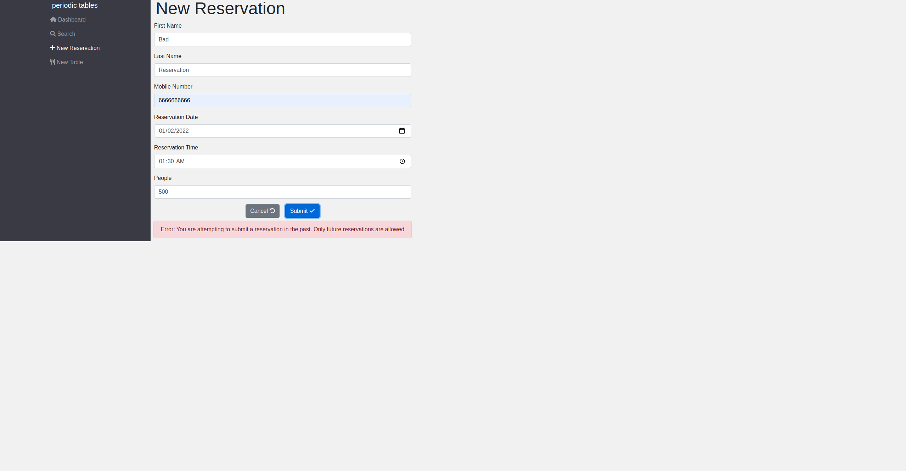

- ### US-03 Create reservation within eligible timeframe
  As a restaurant manager
  I only want to allow reservations to be created during business hours, up to 60 minutes before closing
  so that users do not accidentally create a reservation for a time we cannot accommodate.

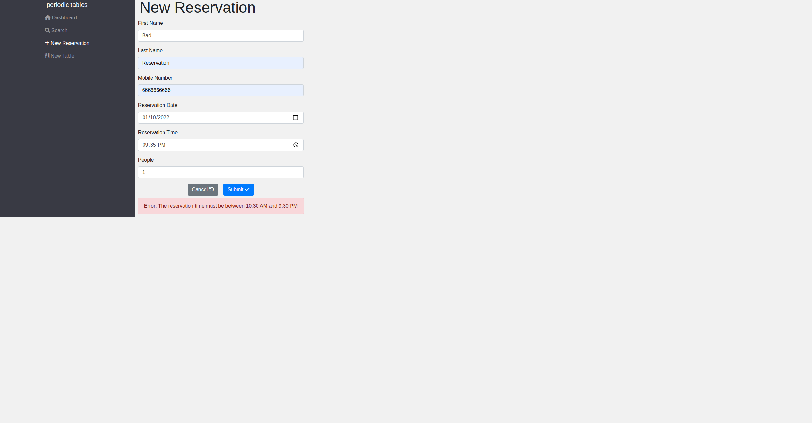

- ### US-04 Seat reservation
  As a restaurant manager,
  When a customer with an existing reservation arrives at the restaurant
  I want to seat (assign) their reservation to a specific table
  so that I know which tables are occupied and free.

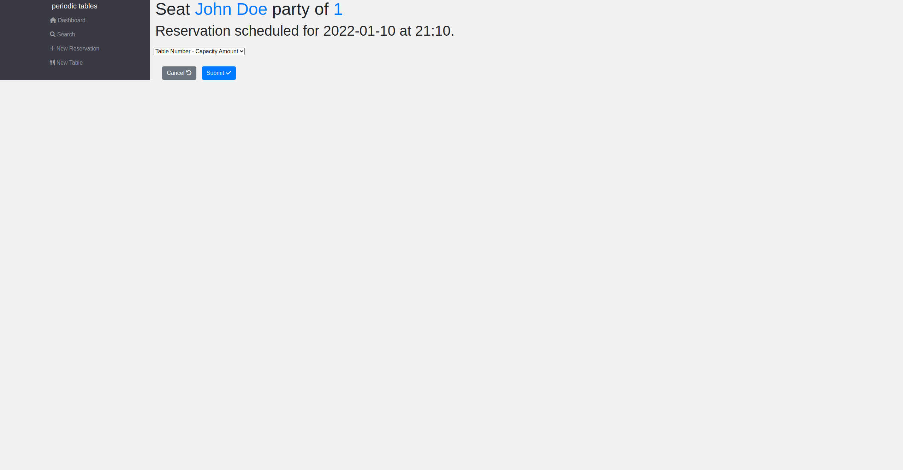
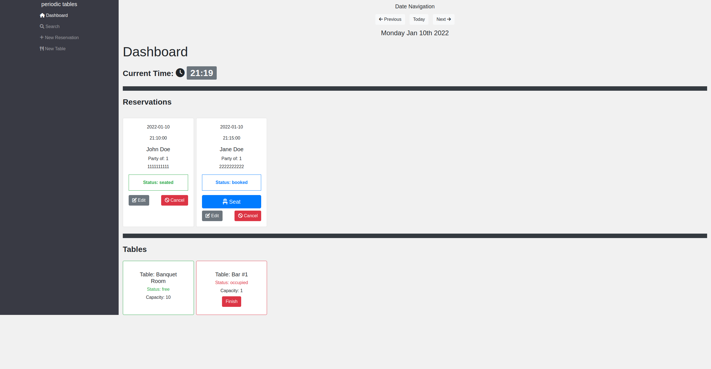

- ### US-05 Finish an occupied table

  As a restaurant manager
  I want to free up an occupied table when the guests leave
  so that I can seat new guests at that table.

  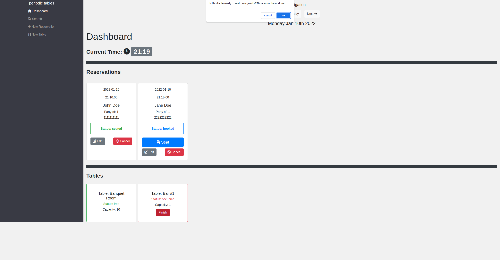
  

- ### US-06 Reservation Status

  As a restaurant manager
  I want a reservation to have a status of either booked, seated, or finished
  so that I can see which reservation parties are seated, and finished reservations are hidden from the dashboard
  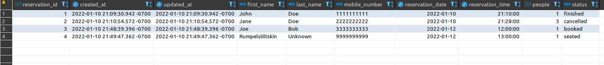

- ### US-07 Search for a reservation by phone number

  As a restaurant manager
  I want to search for a reservation by phone number (partial or complete)
  so that I can quickly access a customer's reservation when they call about their reservation.

  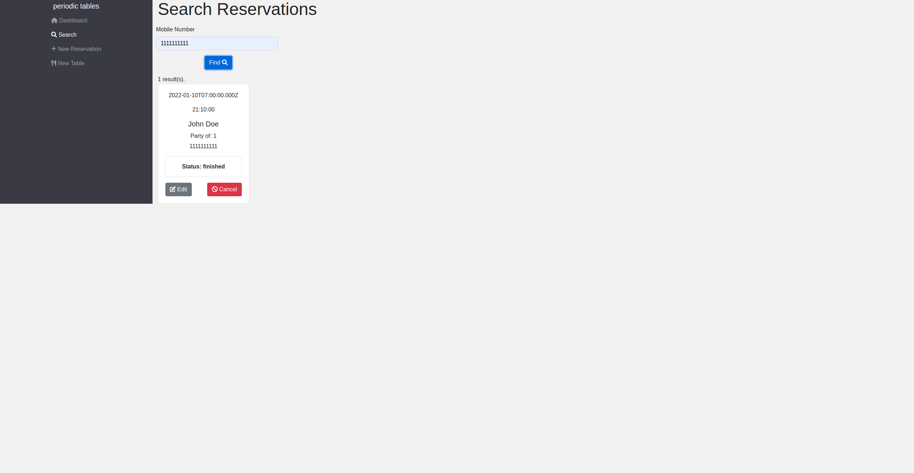

- ### US-08 Change an existing reservation

  As a restaurant manager
  I want to be able to modify a reservation if a customer calls to change or cancel their reservation
  so that reservations are accurate and current.

  
  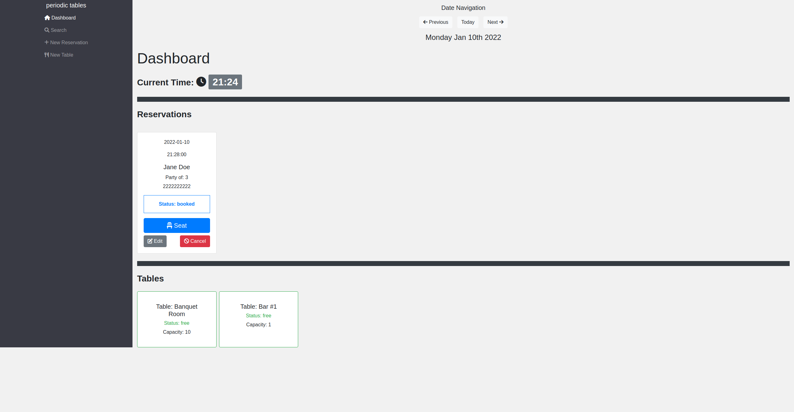
  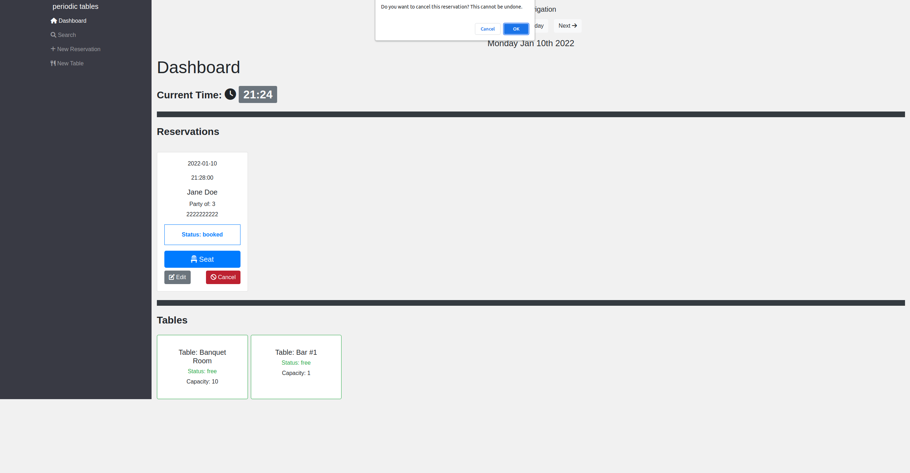
  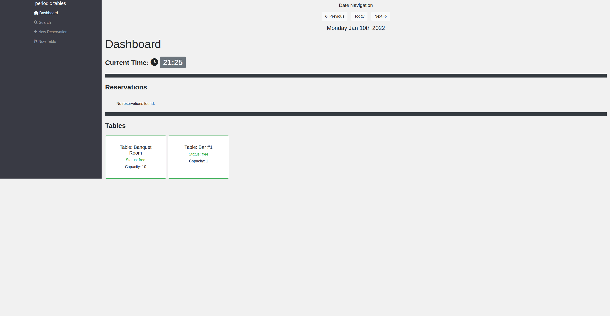
  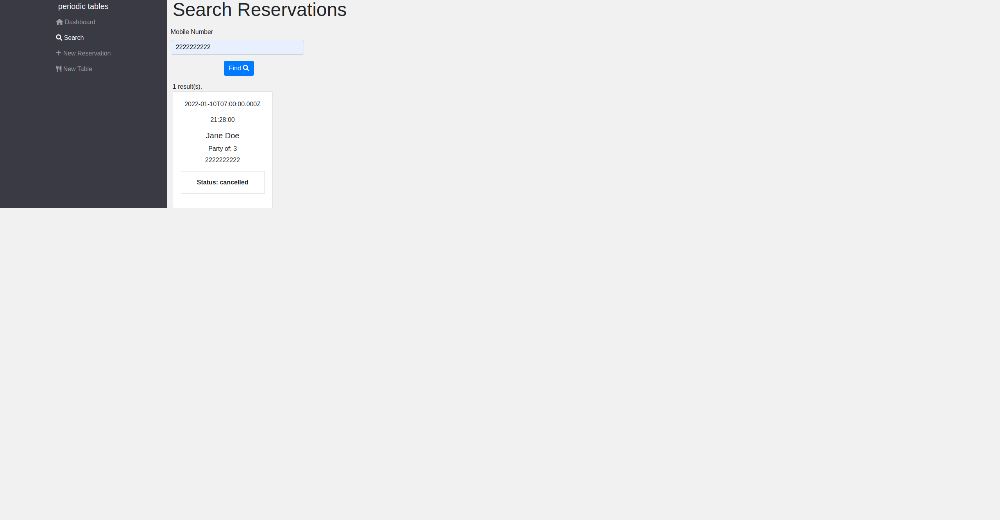

## Technologies used

_Back-end_

- Node
- Express
- Knex
- PostgreSQL (via ElephantSQL)
- Jest

_Front-end_

- React
- Bootstrap
- e2e tests
- Puppeteer

## Back-end

API Base Url: https://reservation-capstone-backend.herokuapp.com/

| Endpoint                                  | Description                                                            |
| ----------------------------------------- | ---------------------------------------------------------------------- |
| `GET /reservations`                       | returns all reservations                                               |
| `POST /reservations`                      | creates and returns a new reservation                                  |
| `GET /reservations?date='YYYY-MM-DD'`     | returns reservations by date (sorted asc)                              |
| `GET /reservations?mobile_number=123`     | returns reservations by partial match of phone number                  |
| `GET /reservations/:reservationId`        | returns reservation matching the reservationId                         |
| `PUT /reservations/:reservationId`        | updates and returns the reservation matching the reservationId         |
| `PUT /reservations/:reservationId/status` | updates only the status of a reservation                               |
| `GET /tables`                             | returns all Tables                                                     |
| `POST /tables`                            | creates and returns a new table                                        |
| `PUT /tables:table_id/seat`               | updates a table with a reservationId and changes status to "occupied"  |
| `Delete /tables:table_id/seat`            | updates a table by deleting reservationId and changes status to "free" |

## Installation

1. Fork and clone this repository.
1. Run `cp ./back-end/.env.sample ./back-end/.env`.
1. Update the `./back-end/.env` file with db connections. You can set some up for free with ElephantSQL database instances.
1. Run `cp ./front-end/.env.sample ./front-end/.env`.
1. You do not need to make changes to the `./front-end/.env` file unless you want to connect to a backend at a location other than `http://localhost:5000`.
1. Run `npm install` to install project dependencies.
1. Run `npm run start:dev` from the back-end directory to start your server in development mode.
1. Run `npm start` from the front-end directory to start the React app at http://localhost:3000.
