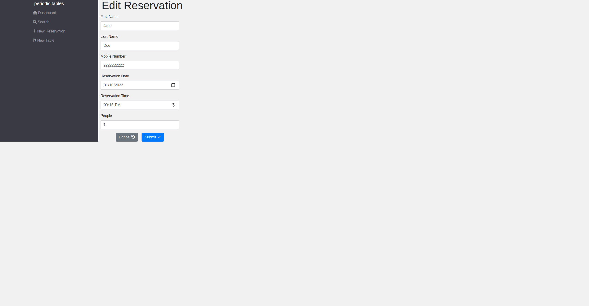

# Restaurant Reservation

## Live Demo

[Restaurant Reservation](https://reservation-front-end.herokuapp.com/)

This is a full stack capstone project for [Thinkful's software engineering bootcamp](https://www.thinkful.com/bootcamp/web-development/). The following scenario was given as a prompt:

> You have been hired as a full stack developer at a startup that is creating a reservation system for fine dining restaurants.
> The software is used only by restaurant personnel - at this point, the customers will not access the system online.

## User Stories

The application was developed following the user stories supplied by a figurative manager, using a test driven development process. Users (restaurant employees) of this application can currently:

- Create a new reservation (when a customer calls in) with contact details

- Multiple validations ensure a reservation can not be made outside of business hours or created in the past.

- Create instances of each table and seating capacity that are available to customers so that reservations can be assigned to a table when the party arrives at the restaurant.

- Assign a reservation to a table to occupy a table at the restaurant.

- "finish" a table to make that table available for use again and remove the customer from view on the dashboard.

  
  

- Edit a reservation with new details if a customer calls back and wants to make a change.

- Search for reservations using a full or partial phone number.
- A reservation can also be cancelled and the reservation is removed from view on the dashboard.

## Technologies used

_Back-end_

- Node
- Express
- Knex
- PostgreSQL (via ElephantSQL)
- Jest

_Front-end_

- React
- Bootstrap
- e2e tests
- Puppeteer

## Back-end

API Base Url: https://reservation-capstone-backend.herokuapp.com/

| Endpoint                                  | Description                                                            |
| ----------------------------------------- | ---------------------------------------------------------------------- |
| `GET /reservations`                       | returns all reservations                                               |
| `POST /reservations`                      | creates and returns a new reservation                                  |
| `GET /reservations?date='YYYY-MM-DD'`     | returns reservations by date (sorted asc)                              |
| `GET /reservations?mobile_number=123`     | returns reservations by partial match of phone number                  |
| `GET /reservations/:reservationId`        | returns reservation matching the reservationId                         |
| `PUT /reservations/:reservationId`        | updates and returns the reservation matching the reservationId         |
| `PUT /reservations/:reservationId/status` | updates only the status of a reservation                               |
| `GET /tables`                             | returns all Tables                                                     |
| `POST /tables`                            | creates and returns a new table                                        |
| `PUT /tables:table_id/seat`               | updates a table with a reservationId and changes status to "occupied"  |
| `Delete /tables:table_id/seat`            | updates a table by deleting reservationId and changes status to "free" |

## Installation

1. Fork and clone this repository.
1. Run `cp ./back-end/.env.sample ./back-end/.env`.
1. Update the `./back-end/.env` file with db connections. You can set some up for free with ElephantSQL database instances.
1. Run `cp ./front-end/.env.sample ./front-end/.env`.
1. You do not need to make changes to the `./front-end/.env` file unless you want to connect to a backend at a location other than `http://localhost:5000`.
1. Run `npm install` to install project dependencies.
1. Run `npm run start:dev` from the back-end directory to start your server in development mode.
1. Run `npm start` from the front-end directory to start the React app at http://localhost:3000.
